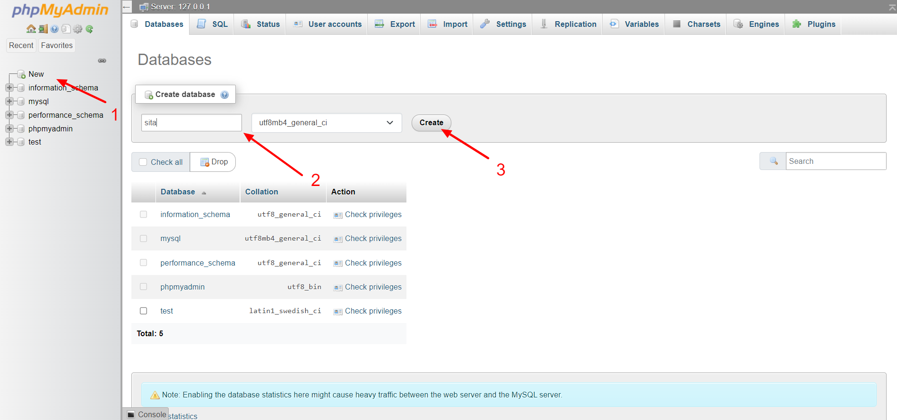
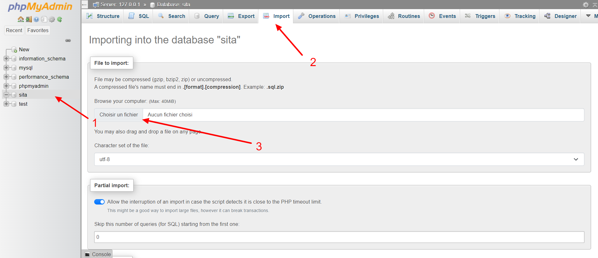
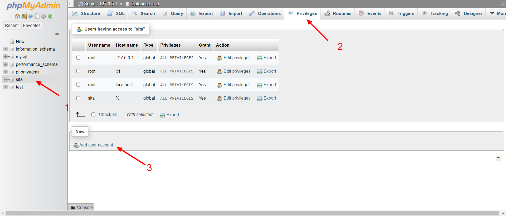
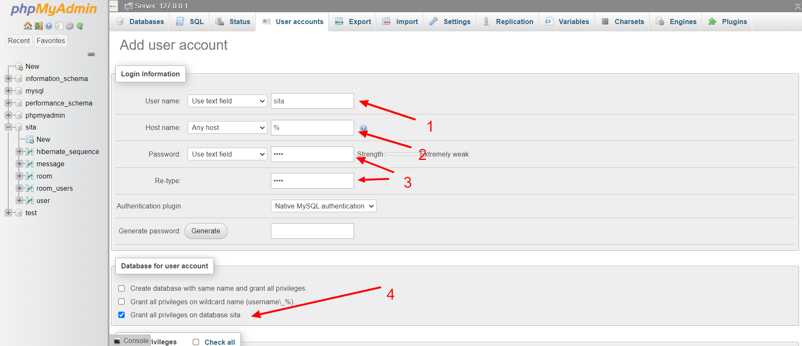

# README

## Using XAMPP for MariaDB

1. Go to [phpmyadmin](http://localhost/phpmyadmin/)
2. Create new database named 'sita'

3. Import data from file `db_dump/data_base_sita.sql`

4. Click on `Add user account` 

5. Use the following credentials

| **Filed** | **Value** |
|-----------|-----------|
| username  | sita      |
| host name | %         |
| password  | sita      |
   
   Check the option `Grant all privileges on database sita`  
   
   

## User accounts to access the application
the following users where created 
(using sahar@gmail.com is recommended):

| user             | password |
|------------------|----------|
| sahar@gmail.com  | sahar    | 
| jules@gmail.com  | 123      | 
| marie@gmail.com  | 123      |
| pierre@gmail.com | 123      |

## Postman collection 
a postman collection is provided containing all EndPoints in this repo
find it in `postman/sita.postman_collection.json` `postman/sita.postman_environment.json`

## Known issues
- using 'userId' as 'access token'
- test coverage is very limited due to time constraints
- lack of an exception handler to handle error codes such as 400, 404, 403...